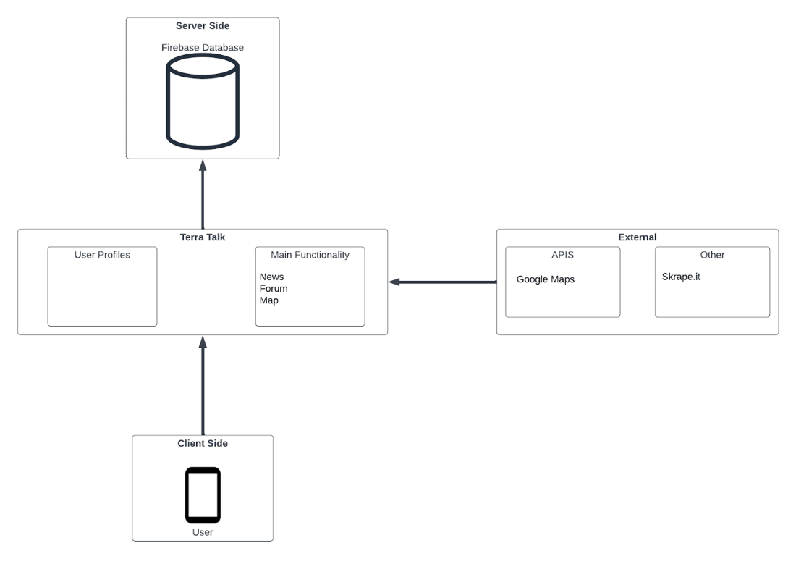
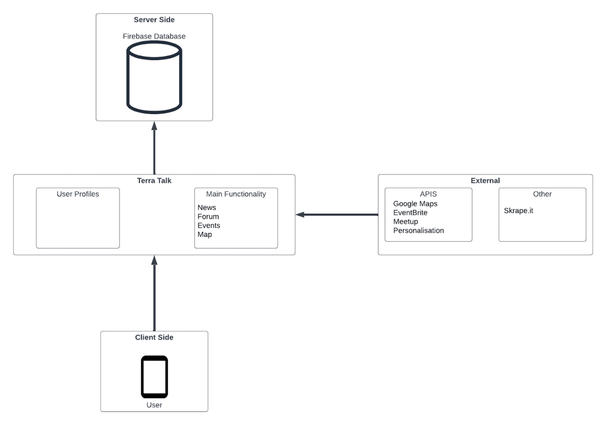
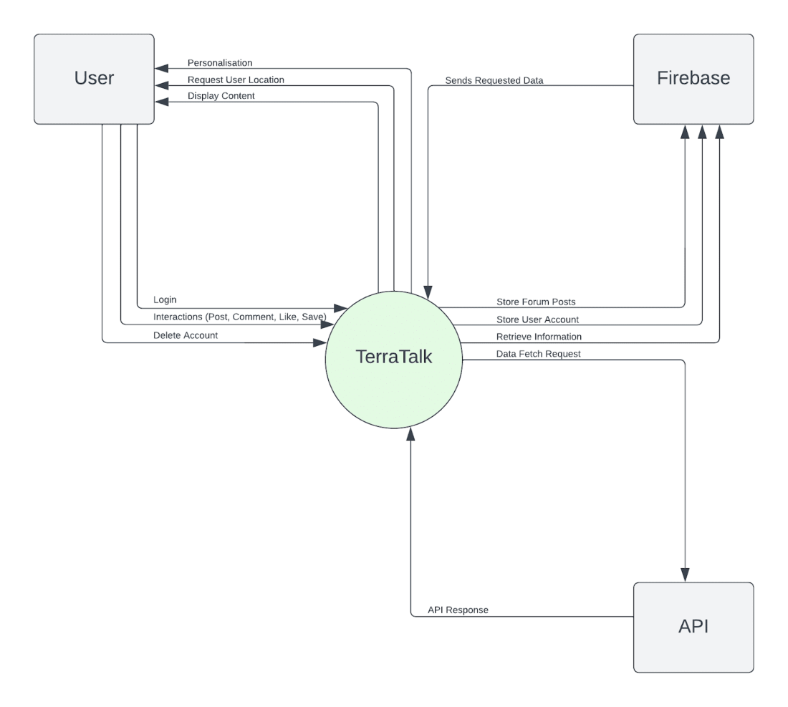
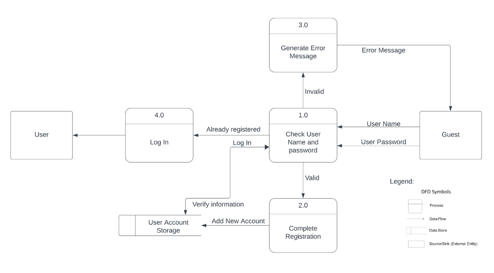
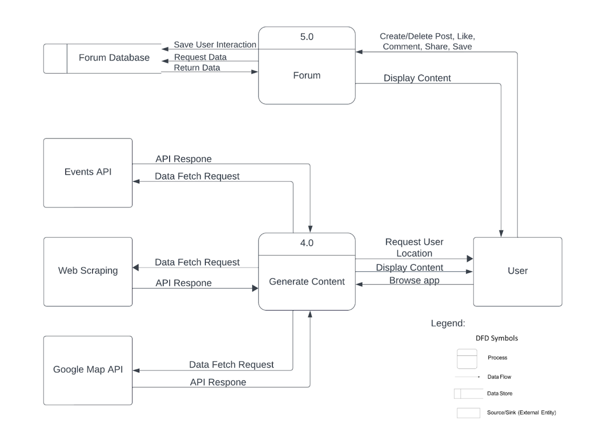
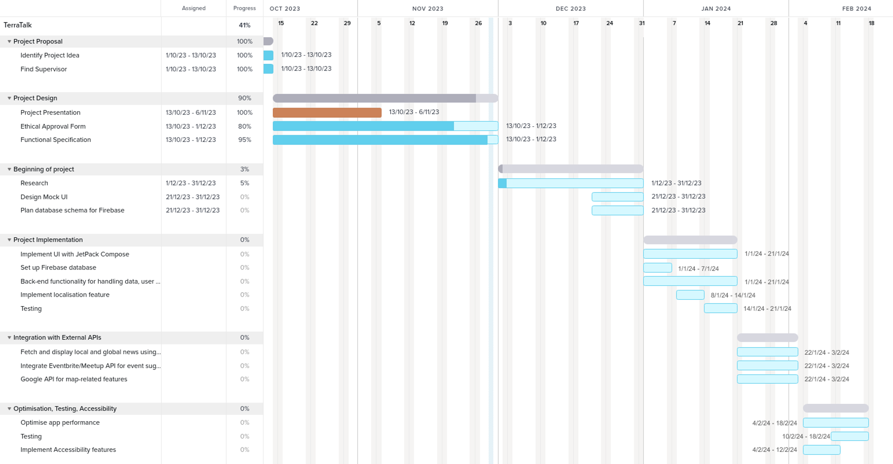
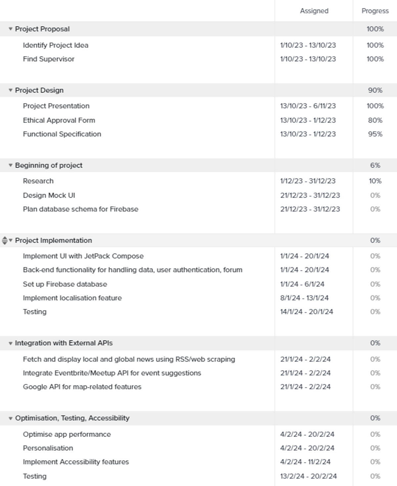

# TerraTalk Functional Specification

## Table of contents
1. [Introduction](#Introduction)
   - 1.1 [Overview](#1.1)
   - 1.2 [Business Context](#1.2)
   - 1.3 [Glossary](#1.3)

2. [General Description](#GeneralDescription)
   - 2.1 [Product / System Functions](#2.1)
   - 2.2 [User Characteristics and Objectives](#2.2)
   - 2.3 [Operational Scenarios](#2.3)
   - 2.4 [Constraints](#2.4)

3. [Functional Requirements](#FunctionalRequirements)
   - 3.1 [User Registration and Authentication](#3.1)
   - 3.2 [User Interaction](#3.2)
   - 3.3 [User Profiles](#3.3)
   - 3.4 [Map feature and filtering](#3.4)
   - 3.5 [Forum Section](#3.5)
   - 3.6 [News Page](#3.6)
   - 3.7 [Events Section](#3.7)
   - 3.8 [Personalisation](#3.8)
   - 3.9 [Security and Privacy](#3.9)

4. [System Architecture Diagram](#SystemDiagram)
   - 4.1 [Minimum Viable Product](#4.1)
      - 4.1.1 [Minimum Viable Product Description](#4.1.1)
   - 4.2 [Stretch Goals](#4.2)
      - 4.2.1 [Stretch Goals Description](#4.2.1)

5. [High-Level Design](#HighLevelDesign)
   - 5.1 [Context Diagram](#5.1)
      - 5.1.1 [Context Diagram Description](#5.1.1)
   - 5.2 [Data Flow Diagram for User Authentication](#5.2)
      - 5.2.1 [Data Flow Diagram for User Authentication Description](#5.2.1)
   - 5.3 [Data flow diagram of User - Application Interaction](#5.3)
      - 5.3.1 [Data flow diagram of User - Application Interaction Description](#5.3.1)

6. [Preliminary Schedule](#PreliminarySchedule)
   - 6.1 [Gantt Chart](#6.1)
   - 6.2 [Task List](#6.2)

7. [Appendices](#Appendices)

# 1. Introduction

## 1.1 Overview

TerraTalk is an android app that acts as a social and educational platform for people that are environmentally conscious. Environmentalism is a topic that is becoming more and more prevalent to the general public and we wanted to create an app that gave people a resource that makes green living more accessible to the average person.

We took inspiration from websites such as Treehugger and EthicalConsumer which are educational websites that share many articles about sustainable living and environmentalism. We wanted to create an app version that also acts as a social media as we saw that these websites lacked a social aspect

## 1.2 Business Context

There is definitely a market for this application, as I mentioned previously we took inspiration from Treehugger and EthicalConsumer. Treehugger has 2.6 million monthly users and EthicalConsumer has 15,00 subscribers which shows that there is a user base for applications who focus primarily on environmental topics.

We took elements from each to combine and add to, such as the news section from Treehugger. To enhance this feature we wanted to utilise the user location to provide news from their own country/local area. EthicalConsumer has the website sectioned off based on topics such as travel/clothing/food where they have information pieces on each. We have done something similar with our forum section which has been divided into different topics for users to explore separately based on their interests.

Unlike these websites that only focus on articles and guides we wanted to implement our application as a social media. This shows that we are focusing on a key feature that sets us apart from these other applications but by taking inspiration from different websites we can utilise what is already successful and improve on it.

## 1.3 Glossary

**API**

APIs (Application Programming Interface) is a tool that enables two software components to communicate and exchange data with each other using a set of protocols (rules) and definitions.

# 2. General Description

## 2.1. Product / System Functions

Below we have the main functions of our app, which will be explained in more detail in the document. These functionalities are preliminary and may change once app implementation begins.

The main functions of this app are:

- To allow registered users to create, like, share and comment on posts in the forum
- To allow users to view a map of their local area indicating vegan restaurants, community gardens and bicycle recharge stations. We will be using Google Maps API for this feature.
- To showcase local and global news on the frontpage regarding topics related to environmentalism. We will be utilising Web scraping for this functionality more specifically Skrape.it which is a Kotlin based web scraping tool
- There will be an events page that will advertise different events such as talks, fundraisers, workshops and protests. We will be using Eventbrite API and Meetup API for this feature.

## 2.2 User Characteristics and Objectives

**User technical knowledge**

Users will be able to download and access TerraTalk from Google Play Store.

User’s technical knowledge doesn’t need to be advanced in order to install & operate the application.

**Requirements from the User’s perspective**

- Easy access to the app & one-click button installation from Google Play store.
- Easy to follow & intuitive app design that doesn’t confuse the user
- Have access to reliable information both Global & Local
- Gain all necessary information about the local area
- Have accessibility features for people that may require them
- Allow users to create their own events and depending on popularity their event will be promoted on the events page.

## 2.3 Operational Scenarios

Some scenarios that the user may encounter when using our application.

**Scenario 1**

User Objective: Register

User Action: Users are prompted to register for the first time when opening the application or on the Account Tab they can choose to log out their current account and register with a new address.

**Scenario 2**

User Objective: User wants to find local recycling points

User Action: User goes on the Map tab in the application and interacts with the filters & map to find the nearest recycling point.

**Scenario 3**

User Objective: Delete Account

User Action: User goes into the Account Tab and selects Delete Account button, followed by a prompt asking them if they are sure that they want to delete their account.

**Scenario 4**

User Objective: Make post

User Action: User goes to the forum section and presses the Make Post button. This will prompt them to select the topic of their post and they can start writing their post.

**Scenario 5**

User Objective: Save Post/News/Event

User Action: Accompanied with every Post/News/Event will be an Icon the user can click to save it to their account for viewing later. The Saved Posts page will be on the Account Tab.

**Scenario 6**

User Objective: Select Topic of Interest

User Action: Accompanied with every Post/News/Event will be an Icon the user can click to save it to their account for viewing later. The Saved Posts page will be on the Account Tab.

## 2.4 Constraints

**Internet access**

This app will require internet connection in order to function as it is fetching data from multiple APIs.

**Accessibility**

Application will be suitable to be read on any device, any screen size, with a simple and intuitive layout. There will be a special application theme with contrasting colours to make access for people with colour blindness easier.

**Latency**

As TerraTalk will use a multitude of APIs there may be constraints about the speed it can fetch that information, process it and display it. We have planned a period where we will focus on optimising the application but due to limited time it may still not be very efficient.

**Hardware platform**

In order to access the application users will need to own and/or have access to an Android phone that was released in the past 5 years.

**Software platform**

Android 13 and above as required by [Target API level requirements for Google Play apps](https://support.google.com/googleplay/android-developer/answer/11926878?sjid=6817173475692656219-EU).

**Limited time**

The development time of this application is limited. We have to plan our development process very carefully & allow time for research.

# 3. Functional Requirements

## 3.1 User Registration and Authentication:

Description:

Users must be able to create an account with our app connected to their email address and have a unique username and secure password. This account has to be authenticated through the user's email.

Criticality:

This is a critical requirement as without users being able to register onto the app there would be no way for them to post content and events, save events and see personalised forum posts. Authentication is a critical feature because without it the users privacy is breached and sensitive information is compromised. Users can use a guest account but they will not have full access to all the features of the app

Dependency:

All other features depend on user authentication and registration.

Technical Issues:

Some technical issues that we could face is that we would have to restrict the usernames people can choose from so every user has a unique username. We would also need to impel users to choose passwords that are strong and and secure by including capital letters, numbers and special characters

## 3.2 User Interaction:

Description:

Users should be able to like, share, comment and save other users posts in the forum section. Users should also be able to create and delete their own posts.

Criticality:

This is a critical feature because it allows for users to engage with the content in the app and with other users. Our app focuses on the social aspect of environmentalism so without this feature our app is not performing its intended purpose.

Technical Issues:

A potential technical issue would be ensuring that real time updates are synchronised across all devices especially with a larger user base. We would need to ensure that the system can scale effectively to handle all the simultaneous interactions

Dependency:

This feature is dependent on the user registration and authentication feature, if there are no users registered onto the app then they cannot interact with each other. It is also dependent on the Forum Section

## 3.3 User Profiles:

Description:

When a user registers we want them to be able to set a profile picture, a bio and a display name to customise their experience on the app. When a user clicks on a profile they will be able to see an archive of all the posts and comments the user has created since registering for the app. Users will also have private access to posts they have saved for later viewing.

Criticality: This is a feature of low criticality, users do not need to customise their profile to get the full experience of our app

Technical Issues:

Data retrieval efficiency would be a possible technical issue as we have to optimise database queries to speed up data retrieval to display user specific archived posts and comments. This would also be an issue related to scalability as we would need to find a solution to handle the growing amount of user generated content and displaying it.

Dependencies:

The user profile would be dependent on the user registration and user interaction. Before creating a profile the user would need an account and for the profile to display the history of posts and comments the user would need to have the ability to create and save posts.

## 3.4 Map feature and filtering:

Description:

Users will be able to view a map of their local area which will display recycling points, vegan/vegetarian restaurants, recharging stations for electric bikes and the locations of events. Users can use filtering to select only the features they want to see so the map does not become overcrowded with markers. We will utilise Google Maps API to display this information and also gain access to the users location

Criticality:

This feature is of moderate criticality because the app will still function without it but this is a feature we would like to include for the end result to show even more of the capabilities of this app.

Technical Issues:

Some potential issues are efficiently updating the data for the location based data within the users proximity and ensuring that the UI for filtering out markers on the map is easy for the users to understand and not too clustered and overwhelming.

Dependencies:

This feature would depend on the app's ability to safely access the user's location and give updates based on any location changes.

## 3.5 Forum Section:

Description:

The forum is separated into different sections based on the user's interests such as (gardening, vegan recipes, bike repair tips, etc.). This allows for users to only contribute posts to whatever topic is relevant to them. Users can follow different topic subforums so their feed is personalised to their interests. Users can also like, comment and save posts from other users.

Criticality:

This is a high criticality feature as this is the feature that we are basing a large majority of our app around. There are many other apps that provide articles and news about environmentalism but our focus is the social aspect. This is the selling point of our app so it is a high critical feature

Technical Issues:

One major issue is implementing content moderation into the forums so we can filter out possibly offensive or harmful content, even trying to moderate content that is not relevant to the sub forum will be a technical issue we might have to face.

Dependencies:

This feature is dependent on Users ability to register and interact with content. Without the user having an established account they are not able to post content onto the Forum Section, instead they will have to use a guest account which will not allow for posting, commenting or liking of content.

## 3.6 News Page:

Description:

There will be a local and global news page which uses web scraping to only showcase news articles that have relevance to environmentalism or sustainability. This feature will be utilising the users location in order to get local news articles that are relevant to their location

Criticality:

This feature is of moderate criticality, the app will continue to function if this feature is not implemented but it is a core feature in the app so we are naming it to be moderate instead of low.

Technical Issues:

Providing real time updates will be a potential issue, we will need to set up periodic background tasks to ensure that the news displayed on our app is up to date and relevant.

Providing enough security for the user when accessing their location to showcase local news will also be a potential issue we will have to face. If this information is compromised it will be an extreme violation of the users privacy and we will need to ensure it does not happen

Dependencies:

This feature will be dependent on the user's location which we will access using Google Maps API.

## 3.7 Events Section:

Description:

The events section will be using Eventbrite and Meetup API to showcase events with relevance to environmentalism and sustainability such as fundraisers, talks, protests and workshops. Users can also advertise events in the forum section and if they receive enough the event shows up in the official events section.

Criticality:

This is a moderately critical feature as it is a business critical feature but the app isn’t dependent on it to operate. The exclusion of this feature will not break or destroy the app.

Technical Issues:

As we are using external APIs we will need to ensure through error handling that when the data is unavailable that it does not drastically affect our app. We would also need to safely and securely access the location of the user in a way that does not breach the users privacy

Dependencies:

The events sections is dependent on Meetup and EventBrite APIS and the location of the user which will be accessed by Google Maps API

## 3.8 Personalisation:

Description:

Users when registering will be asked to do a small survey on what their main interests are, for example: gardening, vegan recipes, popular cycling paths etc. This way even without any interaction with the app the user will be able to see content that is personalised to them. As the user interacts more with the app we will collect data with their consent on what content they are interacting with the most using an API and through that we will display tailored content on their user dashboard.

Criticality: This is a low critical feature because it is low on our priority list, the app will be able to function properly without it and it is not a business critical feature.

Technical Issues:

We need to be able to coordinate the database to ensure that we are storing the users personal information in a safe and secure manner. Another issue will be on gaining access to consent and properly displaying all relevant information about the data gathering to users.

Dependencies:

Personalisation is dependent on the user registration as without registration the user will not be able to have their own account that we can personalise.

## 3.9 Security and Privacy:

Description:

Ensuring the security of user data is critical. This includes secure storage, transmission, and processing of information. We require the security of user data in many aspects of our app as we are extracting location of the user using Google Maps API and we are storing user information based on interaction within the app for personalisation. All this information needs to be managed and stored in a way that protects the users data from leaks.

Criticality:

This is a high criticality feature as the protection of users data is a mandatory practice whenever extracting sensitive information, particularly location of the user.

Technical Issues:

Implementing encryption techniques to make sure that the data in storage and the data in transit(data that is actively interacting with the servers and the app). This is to prevent any unauthorised access of data by any third parties.

Dependencies:

This feature is dependent on User authentication, User Profile and User interaction

# 4. System Architecture Diagram

## 4.1 Minimum Viable Product
||
|:--------------------------------:|
|**Fig. 4.1**|

### 4.1.1 Minimum Viable Product Description

The Client Side is only the user accessing the application (TerraTalk). The content that the user creates or their interaction with other users' content gets stored inside a FireBase database so all activity on the website is archived. We have some third party technologies interacting with our application such as Google Maps API and Skrape.it for Web Scraping.

## 4.2 Stretch Goals
||
|:--------------------------------:|
|**Fig. 4.2**|

### 4.2.1 Stretch Goals Description

In our Stretch Goals we have added Events to our main functionality and more APIs. EventBrite and Meetup API are to assist in accessing information about local events such as time, date and location. Personalisation of content for the user has also been added and will be handled by an API as well.

# 5. High-Level Design

## 5.1 Context Diagram
||
|:--------------------------------:|
|**Fig. 5.1**|

### 5.1.1 Context Diagram Description

The context diagram above provides a broad overview of how the system engages with external systems at a high level.

## 5.2 Data Flow Diagram for User Authentication
||
|:--------------------------------:|
|**Fig. 5.2**|

### 5.2.1 Data Flow Diagram for User Authentication Description

The above diagram offers a more detailed depiction of the data flow specifically when a user undergoes authentication within our system. It identifies Guest and User as external entities, with 4 different app processes: Check Username and password, Complete Registration, Generate Error Message, Log in; and one Data Store entity that stores User Account information.

## 5.3 Data flow diagram of User - Application Interaction
||
|:--------------------------------:|
|**Fig. 5.3**|

### 5.3.1 Data flow diagram of User - Application Interaction Description

Data flow diagram of how information flows between external entities, app processes and data bases in the context of User - Application interaction. The external entities are User, Events Api, Web Scraping and Google Maps API. These interact with Generate Content and Forum processes.

# 6. Preliminary Schedule

## 6.1. Gantt Chart
||
|:--------------------------------:|
|**Fig. 6.1**|

## 6.2 Task List
||
|:--------------------------------:|
|**Fig. 6.2**|

# 7. Appendices