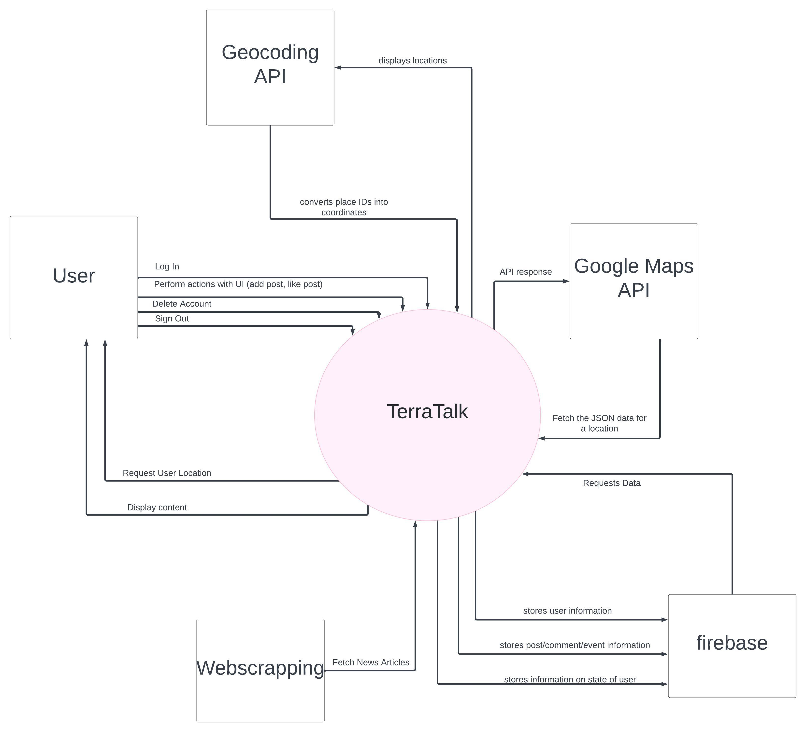
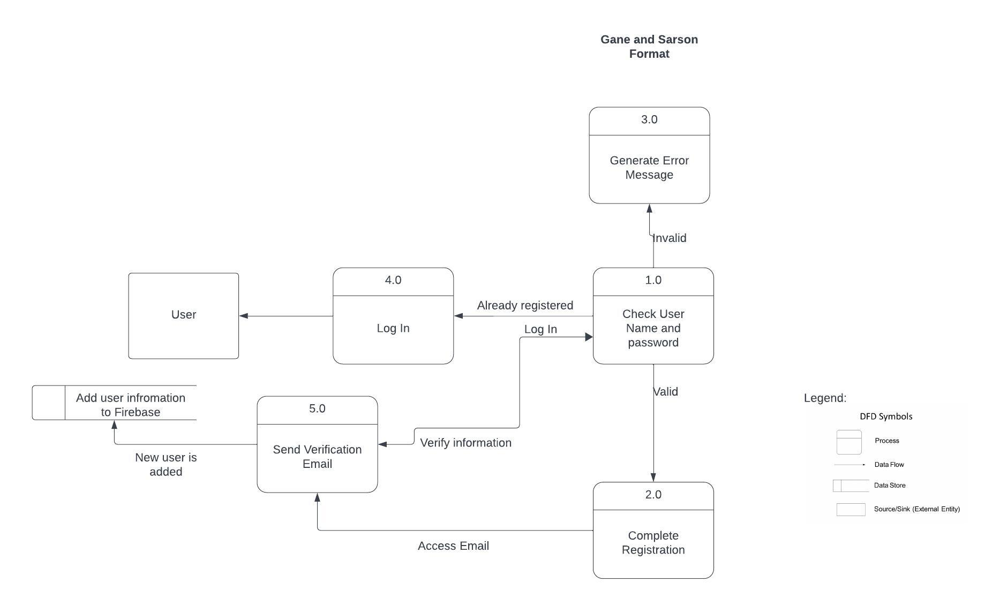
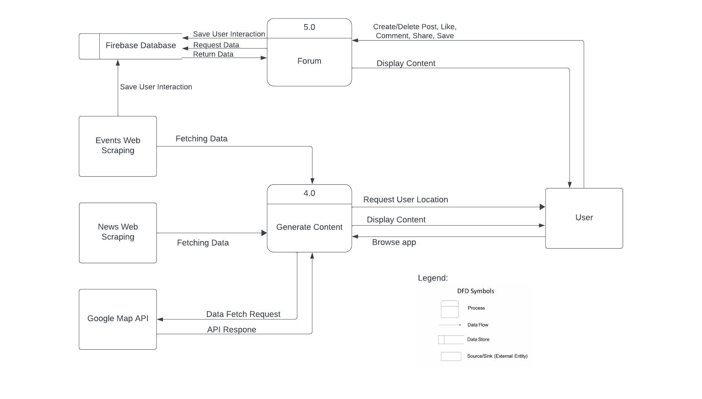

# Technical Specification TerraTalk

## Table of Contents
0. [Table of Contents](#table-of-contents)
1. [Introduction](#introduction)
   1.1 [Overview](#overview)
   1.2 [Main functionalities](#main-functionalities)
   1.3 [Glossary](#glossary)
2. [System Architecture](#system-architecture)
   2.1 [Architecture Design](#architecture-design)
      2.1.1 [Architecture Design Description](#architecture-design-description)
   2.2 [Client](#client)
      2.2.1 [User](#user)
      2.2.2 [User Interface](#user-interface)
      2.2.3 [Android App](#android-app)
      2.2.4 [External APIS/Data](#external-apisdata)
      2.2.5 [Firebase Realtime Database](#firebase-realtime-database)
3. [High Level Design](#high-level-design)
   3.1 [Context Diagram](#context-diagram)
      3.1.1 [Context Diagram Description](#context-diagram-description)
   3.2 [Data Flow Diagram For User Authentication](#data-flow-diagram-for-user-authentication)
      3.2.1 [Data Flow Diagram For User Authentication Description](#data-flow-diagram-for-user-authentication-description)
    3.2 [Data Flow Diagram For Application Interaction](#data-flow-diagram-for-application-interaction)
      3.2.1 [Data Flow Diagram For Application Interaction Description](#data-flow-diagram-for-application-interaction-description)
4. [Problems and Resolution](#problems-and-resolution)
   4.1 [Issues with Online Emulation](#issues-with-online-emulation)
   4.2 [Fetching Data for Events](#fetching-data-for-events)
   4.3 [Implementing Google Maps APIs](#implementing-google-maps-apis)
5. [Installation Guide](#installation-guide)
   5.1 [Minimum Requirements](#minimum-requirements)
   5.2 [Android Studio Configuration](#android-studio-configuration)
   5.3 [Setting up physical device](#setting-up-physical-device)
6. [Testing](#testing)
   6.1 [Unit Testing](#unit-testing)
   6.2 [User Testing](#user-testing)

## 1. Introduction
### 1.1 Overview
TerraTalk is a social media platform that has a wide range of functionalities for users to interact with one another about the topic of environmentalism. This android app was created using the programming language Kotlin and Jetpack Compose for the UI. TerraTalk uses the Firebase Realtime Database using key-value stores. It stores user information securely and allows real-time updates needed to allow all users to access the same content. This application is aimed towards people who want to become more environmentally conscious but don't know where to start. This app provides an easy way to build a community and share ideas with other users.

### 1.2 Main functionalities
#### Log In/ Register Page
A page that allows the user to log in/ register to the application. It will send a verification request through the email given, and the user will be able to log in only after verifying the email address.

#### News Page
A page that uses data scraped from news websites (The Irish Times, The Independent) that are related to environmentalism. They are displayed chronologically. When the user clicks on the title, they are redirected to the original article website.

#### Events Page
A page that has events scrapped from Eventbrite. The user can see the time, date, and location for the event, and also can bookmark the event if they are interested in participating. Similar to the News Page, clicking on the individual event, the user is redirected to the event page on Eventbrite for more information.

#### Maps Page
A page where the user will be prompted with a permission request to allow the app to track their location. If permissions are accepted, the user location information is used to display a map with the user location. They have the ability to look for vegetarian restaurants and parks that are in their vicinity. If the user denies the location permission, a text is displayed that they cannot access that feature of the app.

#### Forum Page
A page where users can post text-based posts which other users can like and comment on. The user has the option to add a post, delete their posts, like other posts, and comment on them as well.

#### Profile Page
A page where users can check their saved events, liked posts, and where they can sign out.

### 1.3 Glossary
- **Firebase Realtime Database**: A cloud-hosted NoSQL database by Google Firebase for real-time data storage and synchronization.
- **Web Scraping**: Automated extraction of data from websites.
- **Firebase Authentication**: Google service for user authentication in applications.
- **JSON**: Lightweight data interchange format for easy human and machine reading.
- **API**: APIs (Application Programming Interface) is a tool that enables two software components to communicate and exchange data with each other using a set of protocols (rules) and definitions.
- **Emulator**: Software simulation of hardware or software environments.
- **Android SDK**: Tools provided by Google for building Android applications.

## 2. System Architecture
### 2.1 Architecture Design

#### 2.1.1 Architecture Design Description
##### 2.1.1.1 Client
The client side represents all elements interacting within the client node that are interacting with the application.

##### 2.1.1.2 User
The user interacts directly with the UI that is supplied by the application. The user can interact with the app and perform actions that add or delete from the database through the UI.

##### 2.1.1.3 User Interface
The UI is the way in which a user can interact with the application.

##### 2.1.1.4 Android App
TerraTalk will be the mobile client that the user will derive all the functionality from. Here we have all the functionalities for the pages in our application and the functions necessary to manage user interaction.

##### 2.1.1.5 External APIS/Data
We are using multiple different APIs/Data from other applications, which we are accessing through the main application. We are only fetching data and not making any changes to the existing data.

##### 2.1.1.6 Firebase Realtime Database
Firebase Realtime Database is how we are storing all of our data; it is connected to the app directly which can be modified when the user performs actions through the UI. The database is a non-relational database based on NoSQL using key-value stores.

## 3. High Level Design
### 3.1 Context Diagram

#### 3.1.1 Context Diagram Description
This shows how the application interacts with external systems at a high level. We can see that the application uses other existing data from scrapped websites and from APIs but does not change or modify any information. The only system that can cause changes within the application is the user.

### Data Flow Diagram For User Authentication

#### Description
The above diagram offers a more detailed depiction of the data flow specifically when a user undergoes authentication within our system. It identifies the Guest and User as external entities, with 5 different app processes: Check Username and password, Complete Registration, Send Email Verification Email, Generate Error Message and Log In; and one Data Store entity that stores User Account information. The arrows indicate the data that is passed between the processes.

### Data Flow Diagram For Application Interaction

#### Description
The above diagram offers a more detailed depiction of the data flow specifically when a user undergoes authentication within our system. It identifies the Guest and User as external entities, with 5 different app processes: Check Username and password, Complete Registration, Send Email Verification Email, Generate Error Message and Log In; and one Data Store entity that stores User Account information. The arrows indicate the data that is passed between the processes.

## Problems and Resolution
### Issues with Online Emulation
A common problem that we ran into was that the virtual device emulators provided on Android Studio took a very long time to emulate our app and oftentimes would crash because the program would exit on account of how long it was taking. We initially tried to solve this issue by wiping the data or performing cold boots on the online emulator but neither worked for very long and the problem persisted.
We solved this by using USB debugging with a physical device, by connecting a USB cable to our android phone and running the app directly on the phone. This proved to be much easier for us to visualize the layout of the app since it was now on an actual phone so it greatly aided us not only in saving time with testing but also to allow us to create a more user-oriented UI.

### Fetching Data for Events
Another issue we ran into was trying to fetch event information using the Eventbrite API, we were using the ‘search’ function which allows us to search the public events and get a returned paginated response of those events. We implemented the functionality but we kept on getting errors showing us that we were not fetching properly.
When we went through the documentation again more thoroughly we noticed that this function had been deprecated and we needed to find another way of retrieving information about the events.
Similarly to our News page we used web scraping using Jsoup to retrieve public data form the Eventbrite website and implemented our events page similar to how we implemented our news page. Even though initially doing the wrong implementation by switching from using the API to using web scraping we reused a lot of the same code which allowed us to integrate the UI better because we just needed to recycle some code from the news page.

### Implementing Google Maps APIs
Using Google Maps APIs proved more tricky than expected, as there was little documentation about how to implement API calls for Android Development. It took us a lot of trial and error to correctly set up the API calls and responses. One issue when implementing the API was that we were getting API responses but the data we were getting was null. It took us a while to figure out that the parameters specifying our response data class needed to have the same name as in the API callback. For example, our parameter for API response data class was latitude; but the API parameter for that was lat. That was producing null results as obviously, latitude wasn’t a valid response.
Google Maps Nearby Search API, which we use to find places based on user location, doesn’t have some of the options we wanted to implement in our project proposal, such as organic markets, bike recharging points or recycle points. We had to restrict ourselves only to vegetarian restaurants and parks, which are well defined labels in the API.

## Installation Guide
### Minimum Requirements
- Android Studio Hedgehog (2023.1.1)
- Android API/SDK level 26 and above
- Internet Connection
- Android Software Development Kit (SDK) 1.8 (included when downloading Android Studio)

### Android Studio Configuration
1. Clone the repository to access our project.
2. Download and install Android Studio Hedgehog.
3. Open Android Studio.
4. Wait until all the dependencies are installed. After that is done, project files are loaded.
5. Sync project with Gradle Files. There is a short-cut button on the top app bar, besides the search icon.
6. Set up your emulator or physical Android device to run the application. Android Studio comes with a default emulator already installed. However, we recommend using a physical device as it runs more smoothly, though that depends on the availability of an Android Phone. To set up a physical phone, follow steps in section 5.3.
7. Run the application with the green play button on the top app bar.

### Setting up physical device
1. Ensure you have a functional Android Phone that supports Android API/SDK level 26 and above; and a USB cable.
2. If your device does not have developer settings turned on, go to Settings > About Device or About Phone > Scroll to Kernel or Build Number and tap on it 7 times.
3. Go back to your device settings and search for “USB debugging” and turn it on.
4. Plug the USB cable into your phone and your machine. A pop up will appear to allow permission for the machine (in this case, Android Studio) to debug apps on your phone. Allow it.
5. After all the steps were completed successfully, the physical phone’s name will appear on the top bar of Android Studio or the Device Manager on the right side bar. Select your phone as the device to run the application on.

## Testing
### Unit Testing
We have implemented some unit tests testing the email & password validation functionality. However, we struggled due to time constraints to test other parts of our application as it contains a lot of external services and it doesn’t contain local functions.

### Functionality Testing
All parts of the app have been thoroughly tested by us and ensured that the application doesn’t bug or crash unexpectedly. We ensured that the user can successfully: register, log in, go to news links, save/unsave events, be prompted with a location permission request, look for vegetarian restaurants, parks; access the forum and its contents, add a post, delete the post if they’re the author, like/unlike posts, add comments; check their saved events & liked posts, sign out.

### User Testing
We've opted to initiate user testing to gain deeper insights into how our application performs in the hands of real users. This approach helps us identify potential technical and non-technical issues. Prior to participation, users were required to complete a consent form. To maintain anonymity, their responses were collected through a Google Forms survey.
There were two sections for the user testing, the first being questions that prompted the user to finish a task within a certain amount of time for example: Verify your email address in under 20 seconds. The second section was more opinion based questions where the users could rate certain aspects of the application based on their own experiences.

As you can see in the attached user survey results most users were able to perform the tasks given to them under the time constraints. From personal feedback given we were able to change certain aspects of the application so that it would be easier for the users to navigate. An example of this is the Log In page, some users were confused to how to submit their username and email because we failed to put in a button to confirm information. With the useful insights that user testing gave us we were able to correct this. 

