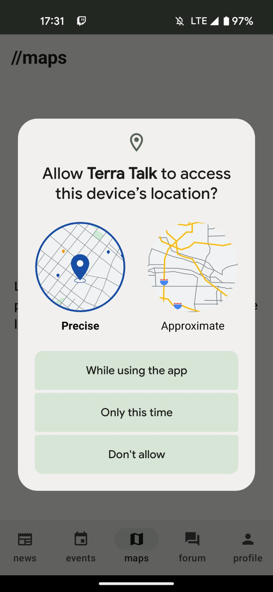
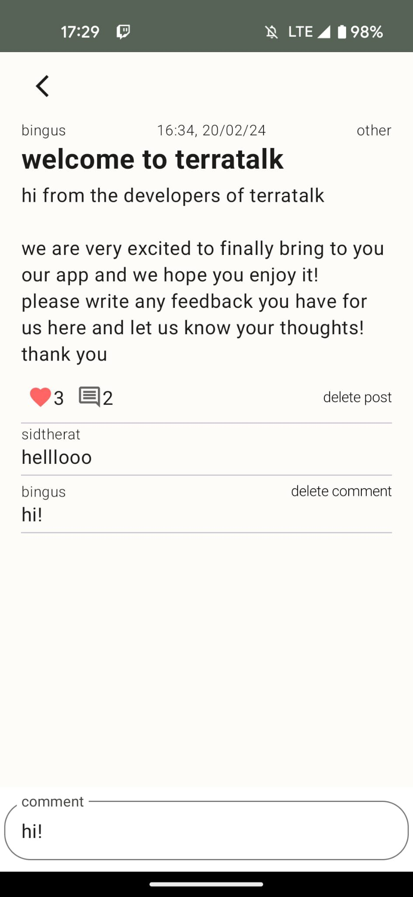

# User Manual

1. **Register**: Register to the app by creating a username and using a valid email and password.

2. **Email Verification**: Verify your email with the link sent to you.

---

## News Page

This is the news page. When you click on the links they will direct you to The Irish Times to the article you have chosen.

---

## Maps Page

- This is the Maps page. 
- The app will ask you to give the device permission to access your location. Only when you have given permission will it display the maps.

### Location Permission Denied Screen

- This is the screen if you choose not to give the app permission for location.

### Maps Page with Location Permission Granted

- This is the maps page after giving permissions to the app to access your location. 
- If you click on Parks, the parks in your local area will be displayed, and same with Vegetarian restaurants.

---

## Events Page

- This is the events page. 
- By clicking on the bookmark icon on the event, you can save it and view it in your profile. 
- By clicking on the title, you will be redirected to the Eventbrite page of that event.

---

## Forum Page

- This is the Forum page where you can see all the created posts by all users existing on the app and how many likes and comments each post has. 
- To like a post, you simply tap on the heart icon. 
- To view the contents of the forum, you click on the title of the post. 
- In the comments field, you can type in your own comment. 
- To create a new post, you can click on the add symbol (+).

### Creating a New Post

- To create a new post for all users to see, you have to create a title and add some more information in the content section. 
- Finally, select a tag for your post and to publish it, click add post.

---

## Profile Page

- This is the Profile page. 
- You can see all of your saved events and your liked posts. 
- You can also see the date at which you joined the app.

